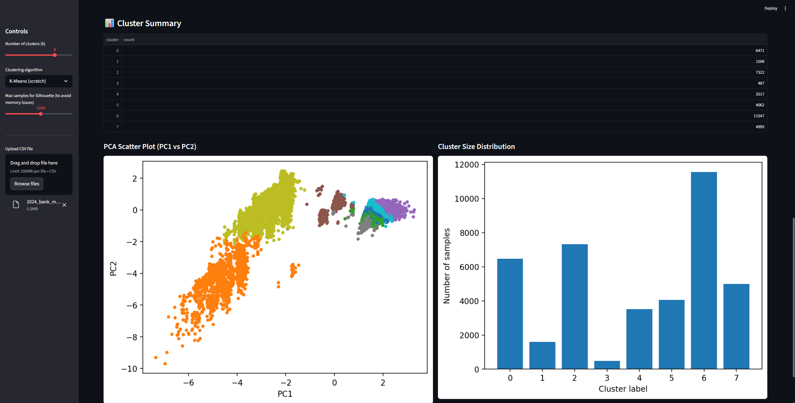

# 📊 Bank Marketing Data Clustering & Analysis

**Author:** Xingye Tan  
**Tech Stack:** Python · PCA · K-Means · Bisecting K-Means · scikit-learn · Streamlit  
**Goal:** Build clustering algorithms from scratch and evaluate segmentation effectiveness for marketing analytics.

---

## 📌 Overview

This project implements a complete **unsupervised learning pipeline** on the Bank Marketing dataset, focusing on:

- Developing **k-Means** and **Bisecting k-Means** from scratch  
- Evaluating clustering performance across **k = 2–10**  
- Applying **PCA** for dimensionality reduction  
- Comparing results with **scikit-learn k-means++**  
- Visualizing clusters through a **Streamlit web app**

The final insights help marketers understand **customer segmentation patterns** and identify high-engagement groups for subscription prediction.

---

## 📂 Project Structure

```
bank-marketing-clustering/
│
├── data/
│   └── 2024_bank_marketing_with_clusters.csv
│
├── src/
│   ├── kmeans.py
│   ├── kmeans.py
│   ├── pca_utils.py
│   └── train_eval.py
│
├── results/
│   ├── metrics.csv
│  
│
├── README.md
└── requirements.txt
```

---

## 📉 Dataset

We use all **10 numerical features** from the Bank Marketing dataset:

- age  
- duration  
- campaign  
- pdays  
- previous  
- emp.var.rate  
- cons.price.idx  
- cons.conf.idx  
- euribor3m  
- nr.employed  

---

## ⚙️ Methods

### **1. k-Means (from scratch)**  
- Random centroid initialization  
- Euclidean distance assignment  
- Custom centroid recomputation  
- Convergence based on centroid movement threshold  

### **2. Bisecting k-Means (from scratch)**  
- Start with all data in one cluster  
- Repeatedly split the cluster with highest SSE  
- Choose the best split after multiple runs  
- Produces more compact and stable clusters  

### **3. PCA Dimensionality Reduction**
- 3 principal components  
- Variance retained: **58.77%**

### **4. Evaluation Metrics**
- **SSE (Sum of Squared Errors)**  
- **Silhouette Score**  
- Averaged across k = 2–10

---

## 📈 Results

### 🔹 Averaged Model Performance (k = 2–10)

| Model | SSE ↓ | Silhouette ↑ |
|------|--------|--------------|
| **bisecting_scratch** | **46,677.94** | **0.6221** |
| kmeans_scratch | 53,700.63 | 0.5508 |
| sklearn_kmeanspp | **46,401.64** | 0.6123 |

**Interpretation:**  
- Bisecting k-Means performs best among scratch implementations.  
- sklearn’s k-means++ is efficient but slightly behind bisecting in Silhouette score.

---

### 🔹 PCA Variance Retained

| Components | Variance |
|-----------|-----------|
| **PCA (3 components)** | **58.77%** |

---

### 🔹 Full Metrics Table  
See full evaluation results:

📄 **[metrics.csv](./results/metrics.csv)**

---

## 🎨 Streamlit App

The project includes an interactive Streamlit dashboard.


Run it locally:

```bash
streamlit run src/app_streamlit.py
```

Features:

- Choose number of clusters *k*  
- Compare three algorithms  
- Visualize clusters in PCA space  
- Inspect segmentation patterns  

---

## ▶️ How to Run the Project

### **1. Clone repository**

```bash
git clone https://github.com/AidenTan-DS/bank-marketing-clustering.git
cd bank-marketing-clustering
```

### **2. Install dependencies**

```bash
pip install -r requirements.txt
```

### **3. Run training & evaluation**

```bash
python src/train_eval.py --data data/2024_bank_marketing_with_clusters.csv --kmin 2 --kmax 10
```

### **4. Launch visualization**

```bash
streamlit run src/app_streamlit.py
```

---

## 🧠 Key Takeaways

- Implementing clustering from scratch deepened understanding of centroid optimization and SSE minimization.  
- Bisecting k-Means provides **more stable segmentation** than standard k-Means.  
- PCA improves interpretability and visualization.  
- Streamlit enables a practical, interactive analytics tool for exploring marketing segments.

---

## 📬 Contact

📧 xtan4@uw.edu  
🔗 GitHub: https://github.com/AidenTan-DS
